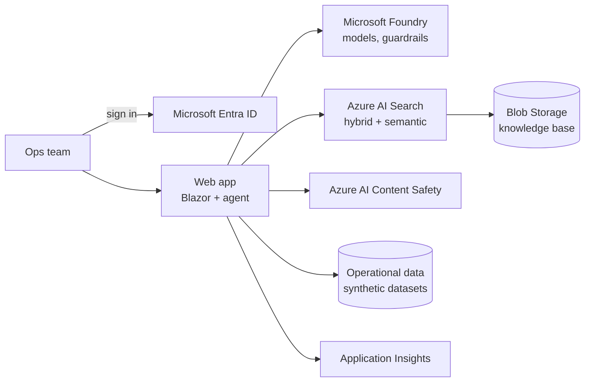

# Payment Ops Investigation Agent

An AI agent that helps payment operations teams figure out why money didn't move when it should have (delayed payouts, missing settlements, processor hiccups) and shows its working along the way.

> 🚧 **Early days.** I'm building this in the open, one piece at a time. Right now the foundations are in place; the interesting parts are on their way.

## Why I'm building this

Payment operations investigations are a really good test of what AI agents can and can't be trusted to do.

When a merchant's payout is late, the answer is usually scattered across several places: settlement records, error logs, a processor's status page, a runbook someone wrote two years ago. An engineer pieces it together by hand. It's slow, it depends on who happens to be on shift, and afterwards there's rarely a clear record of *how* the conclusion was reached.

It's also a domain where getting things wrong matters, and where not everyone should see everything. So I wanted to explore what it takes to build an agent you'd actually be comfortable putting in front of an operations team: one that cites its evidence, respects who is asking, says "I don't know" when it should, and leaves the real decisions to people.

The setting is *Contoso Payments*, a fictional payment service provider. All data in this repository is synthetic.

## How it's meant to work

You ask a question like *"Why were payouts for merchant M-1042 delayed yesterday?"* The agent then:

- **decides for itself what to look at.** It calls typed tools for merchant profiles, settlement batches, error events and processor status, and searches a knowledge base of runbooks and policies. Nothing is scripted.
- **backs up every claim.** Answers cite the documents and data records they came from, and the server checks that each citation was actually retrieved.
- **only sees what you're allowed to see.** Restricted documents are filtered out at retrieval time based on your identity, so the model never sees them in the first place. Telling the model not to reveal them isn't enough.
- **proposes, but doesn't act on its own.** It can suggest raising an incident ticket, but an engineer has to approve it. Anything touching money or merchant status simply has no tool.
- **treats documents and data as untrusted.** Text that tries to give the agent instructions is screened and handled as data, never as a command.

Changes to prompts or models have to pass an evaluation suite before they're deployed.

## Built with

.NET 10 · Blazor · Microsoft Agent Framework · Microsoft.Extensions.AI · Microsoft Foundry · Azure AI Search · Azure AI Content Safety · Microsoft Entra ID · OpenTelemetry and Application Insights · Terraform · GitHub Actions



## What it deliberately doesn't do

It isn't a payments platform. There's no merchant onboarding, KYC or compliance decision-making, no real payments backend, and no real personal or card data. It's one agent rather than a team of them, because the problem doesn't need more. The product requirements are in [docs/PRD.md](docs/PRD.md), and how it's actually built so far is in [docs/Architecture.md](docs/Architecture.md).

## Repository layout

```text
src/
  PaymentOps.Web         Web host, Blazor UI and HTTP endpoints
  PaymentOps.Agent       Agent orchestration
  PaymentOps.Tools       The tools the agent can call: validation, authorization, results
  PaymentOps.Domain      Domain records and data ports (no Azure or AI dependencies)
  PaymentOps.Data.Demo   Adapters over the synthetic datasets
  PaymentOps.Knowledge   Knowledge retrieval and citation checks
  PaymentOps.Platform    Safety, telemetry and cost helpers
eval/                    Evaluation harness and datasets
tests/                   Unit, contract, architecture and smoke tests
docs/                    Product and technical documentation
```

## Running it locally

You'll need the [.NET 10 SDK](https://dotnet.microsoft.com/download/dotnet/10.0).

```bash
dotnet build PaymentOps.slnx
dotnet test PaymentOps.slnx
dotnet run --project src/PaymentOps.Web
```

## Where it's heading

- [x] Project foundations
- [ ] Azure platform and CI/CD with Terraform
- [ ] Sign-in, roles and secured knowledge retrieval with citations
- [ ] Operational data tools and the investigation agent
- [ ] Human approval for incident tickets
- [ ] Evaluation gate, content safety and injection defences
- [ ] Tracing, alerting and cost tracking

## License

[MIT](LICENSE)
