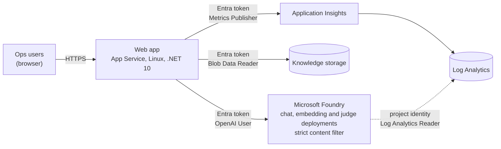
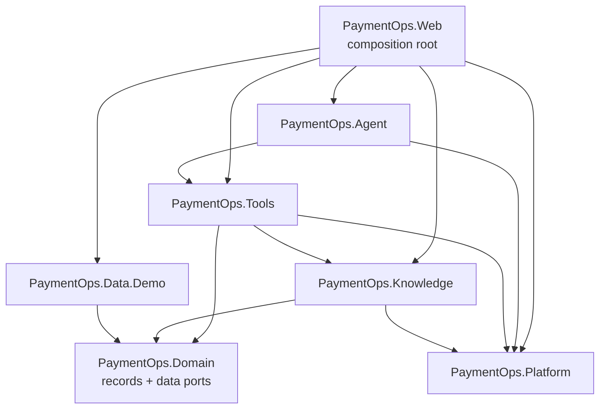

# Architecture (as built)

> Only the foundation is in place so far: module structure, architecture tests, the web host, and the Azure platform defined in Terraform. Product and AI capabilities come next. This document describes what has actually been implemented, and it's updated in the same pull request as the code it describes.

## Current state

| Area | Status |
|---|---|
| Solution structure | ✅ Projects and allowed dependency directions in place |
| Architecture tests | ✅ Dependency rules enforced in `PaymentOps.ArchitectureTests` |
| Web host | ✅ Placeholder Blazor host with a `/health` endpoint |
| Infrastructure | ✅ Terraform bootstrap: state storage and keyless GitHub pipeline identities ([Deployment](Deployment.md)) |
| Azure platform | ✅ Defined in Terraform, with a model preflight. Created by the deployment pipeline (next); nothing is deployed outside it |
| Product and AI capabilities | Not started |

## Azure platform

What runs where, and how each part authenticates. Every service-to-service call uses a managed identity; API keys and shared keys are disabled throughout.

*As of 2026-10-07.* The web app runs as a user-assigned identity, kept separate from the app so its role assignments survive the app being replaced. The model deployments come from `ai/manifest.yaml`, which the application will also read, so the infrastructure and the application can't disagree about which model is live. Role assignments are listed in [Security](Security.md).

## Project references

The system is a single deployable with modular boundaries. The boundaries are enforced by project references, and architecture tests check them on every build. This diagram shows the actual reference graph from the `.csproj` files.

*As of 2026-10-05.* `Web` references every module because it's the composition root, where dependency injection wires the system together. `Data.Demo` implements the data ports defined in `Domain`.

| Rule | Enforced by |
|---|---|
| `Domain` has no project references and no Azure, AI or web packages | `DependencyRulesTests` |
| `Tools` never references the demo adapters or the web host | `DependencyRulesTests` |
| Only the composition root (`Web`) references `Data.Demo` | `DependencyRulesTests` |
| Only `Knowledge` uses the Azure AI Search SDK | `DependencyRulesTests` |
| Nothing references the web host | `DependencyRulesTests` |
