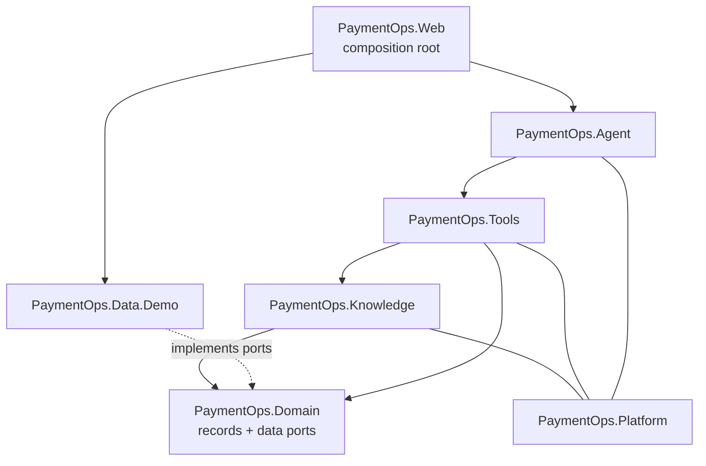

# Architecture (as built)

> **Implementation has not started.** This document describes only what has actually been implemented, and it is updated in the same pull request as the code it describes.

## Current state

| Area | Status |
|---|---|
| Solution structure | ✅ Projects and allowed dependency directions in place |
| Architecture fitness tests | ✅ Dependency rules enforced in `PaymentOps.ArchitectureTests` |
| Web host | ✅ Placeholder Blazor host with a `/health` endpoint |
| Everything else | Not started |

## Module boundaries

The system is a single deployable with modular boundaries, enforced by project references and checked by architecture tests on every build.

*As of 2026-10-05.*

| Rule | Enforced by |
|---|---|
| `Domain` has no project references and no Azure, AI or web packages | `DependencyRulesTests` |
| `Tools` never references the demo adapters or the web host | `DependencyRulesTests` |
| Only the composition root (`Web`) references `Data.Demo` | `DependencyRulesTests` |
| Only `Knowledge` uses the Azure AI Search SDK | `DependencyRulesTests` |
| Nothing references the web host | `DependencyRulesTests` |
