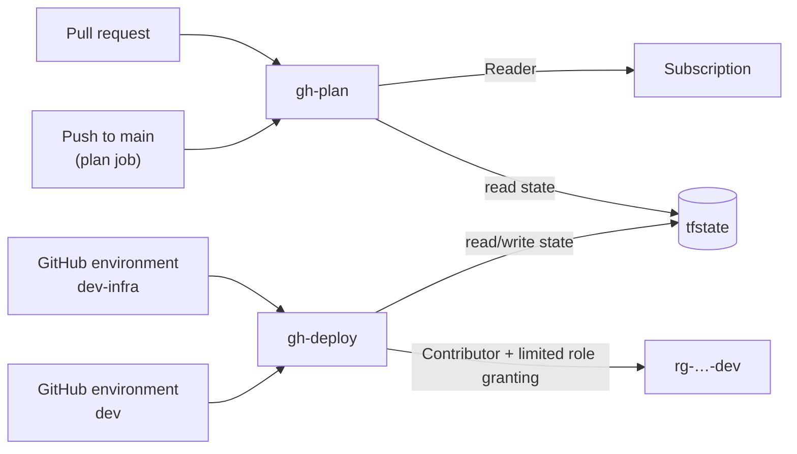

# Deployment

How the infrastructure is organised, and how to set it up in your own Azure subscription.

## How it's organised

All Azure infrastructure is Terraform, in three layers ([ADR 0001](adr/0001-terraform-for-infrastructure.md)):

```text
infra/
├─ modules/        building blocks: state-storage, github-oidc-identity, foundry, web-app,
│                  storage-account, monitoring, cost-guardrail
├─ stacks/         compositions: bootstrap, platform
└─ deployments/    where a stack meets a real subscription: backend, providers, values from env
```

There are two kinds of deployment:

| | What it creates | Who applies it |
|---|---|---|
| **Bootstrap** | Terraform state storage, the GitHub pipeline identities, the environment's resource group, resource provider registration | A person with Owner rights. Re-run only when the bootstrap itself changes |
| **Platform** | Everything the application runs on: models, hosting, storage, monitoring, budget | The GitHub Actions deployment pipeline, after approval (being added next). Workstations only run plans |

The bootstrap can't run through the pipeline, because it creates what the pipeline needs to run: the identity the pipeline signs in as, and the storage that holds its state. Creating them also needs Owner-level rights, which shouldn't sit with any CI identity. So a person runs it with reviewed Terraform code, and the pipeline works inside the boundaries it set up.

## Prerequisites

- An Azure subscription where you're **Owner** (needed for the bootstrap only)
- [Azure CLI](https://learn.microsoft.com/cli/azure/install-azure-cli), signed in with `az login`
- [Terraform](https://developer.hashicorp.com/terraform/install) 1.10 or later
- Bash. On Windows, Git Bash works.

## Configuration

Nothing environment-specific is committed. Copy `.env.example` to `.env` (ignored by git) and fill it in; it lists a recommended value for each setting. Values already set in the environment, such as CI variables, take precedence over `.env`.

| Variable | Example | Purpose |
|---|---|---|
| `ARM_SUBSCRIPTION_ID`, `ARM_TENANT_ID` | | Subscription and Entra tenant to deploy into |
| `TF_VAR_location` | `canadacentral` | Region for every resource |
| `TF_VAR_name_prefix` | `paymentops` | Prefix for resource names |
| `TF_VAR_environment` | `dev` | Environment to deploy |
| `TF_VAR_github_repository` | `owner/name` | The only repository whose workflows can sign in to Azure |
| `TF_VAR_github_owner_id`, `TF_VAR_github_repository_id` | | Numeric IDs, part of the OIDC subject (below). `gh api repos/OWNER/NAME --jq '.owner.id, .id'` |
| `TF_VAR_developer_object_ids` | `'["<object-id>"]'` | Optional. People who run the app locally against Azure |
| `TF_VAR_app_service_sku` | `F1` | App Service plan tier |
| `TF_VAR_dotnet_version` | `10.0` | .NET runtime |
| `TF_VAR_storage_replication_type` | `LRS` | Knowledge storage redundancy |
| `TF_VAR_log_retention_days`, `TF_VAR_log_daily_quota_gb` | `30`, `0.5` | Telemetry retention and daily ingestion cap |
| `TF_VAR_monthly_budget` | `10` | Budget that triggers alert emails |
| `TF_VAR_alert_email` | | Where budget and operational alerts go |
| `TF_VAR_model_retirement_buffer_days` | `90` | Refuse models retiring within this many days |
| `TF_STATE_*` | | Written by the bootstrap script on its first run |

**What isn't configuration.** Model names and versions live in `ai/manifest.yaml` rather than in environment variables. Changing a model changes the system's behaviour, so it goes through a pull request and evaluation. Platform constants, such as built-in Azure role IDs and GitHub's OIDC issuer, are written in the code because they don't vary.

## Bootstrap

```bash
az account set --subscription <subscription-id>
scripts/bootstrap.sh
```

On the first run the script:

1. applies the bootstrap stack with local state;
2. records where the state storage is in `.env`;
3. moves its own state into that storage, then deletes the local copy.

Later runs apply against the remote state directly. To check for drift, run the script and review the plan before confirming.

### What it creates

| Resource | Notes |
|---|---|
| `rg-<prefix>-bootstrap` | Long-lived: state storage and pipeline identities |
| `rg-<prefix>-<environment>` | The environment's resource group, where the platform is deployed |
| State storage account | Zone-redundant. Entra ID only (account keys disabled), TLS 1.2, versioning, 30-day soft delete for blobs and containers, and a delete lock |
| `id-<prefix>-gh-plan` | Pipeline identity for read-only plans |
| `id-<prefix>-gh-deploy` | Pipeline identity for approved deployments |
| *Model Availability Reader* role | Custom role for the model preflight (below) |
| Developer role assignments | Optional, for `TF_VAR_developer_object_ids` |

It also registers the Azure resource providers the platform uses, because registration is a subscription-level action the pipeline identities can't perform. The cost is a few cents a month.

**Why two resource groups.** `gh-deploy` is Contributor on the environment's resource group, which would include changing managed identities and their federated credentials. Keeping the pipeline identities and Terraform state in a separate group, where the pipeline has no rights, means a workflow can't widen its own trust or delete its own state. It also lets an environment be torn down and rebuilt without touching what the pipeline depends on.

## Platform

The platform stack creates everything the application runs on. Each tier is sized for what this workload actually does: a few users and a small knowledge base. Each is a configuration value, so a production environment can choose differently without code changes.

| Component | Dev tier | Cost while idle | Why |
|---|---|---|---|
| Microsoft Foundry resource and project | S0 | None | Hosts the model deployments; API keys disabled |
| Model deployments (`ai/manifest.yaml`) | Global Standard | None, billed per token | Pinned versions, no automatic upgrades |
| App Service plan and web app (Linux, .NET 10) | F1 (free) | None | Enough for a demo workload. B1 and above add always-on and health-check eviction |
| Knowledge storage | Standard LRS | Cents | Entra ID only |
| Log Analytics and Application Insights | Pay per GB, with a daily cap | Within the free allowance | Ingestion requires Entra ID |
| Budget and action group | | Free | Emails at 50%, 80% and 100% of actual spend, and on a forecast overrun |

The strict content filter is attached to the chat deployments: anything above "Safe" in the four harm categories is blocked on prompts and completions, as are jailbreak attempts. The evaluation judge uses Microsoft's default filter, because it has to read deliberately unsafe answers when scoring the safety evaluations.

### Model preflight

Before any model deployment changes, the plan checks each model in `ai/manifest.yaml` against the live Azure model catalog. The plan fails, before anything is applied, if a model:

- isn't offered in the region at its pinned version and deployment type;
- is `Deprecating` or `Deprecated`, and so closed to new deployments;
- retires, or its deployment type is deprecated, within `TF_VAR_model_retirement_buffer_days`.

Quota is shared by every deployment of the same model and deployment type, and depends on what's already deployed, so capacity headroom will be checked by the deployment pipeline immediately before apply. The catalog and quota reads are subscription-level. The plan identity has them through Reader; the deploy identity holds a custom *Model Availability Reader* role limited to them.

### Model lifecycle

Model versions are temporary: Microsoft deprecates a generally available version after about 12 months and retires it after about 18, after which calls fail. Every deployment here is pinned and never upgrades automatically, so a model changes only through a reviewed change to `ai/manifest.yaml` that passes evaluation ([ADR 0002](adr/0002-pinned-model-versions.md)).

The upgrade path, once the evaluation gate is in place: add the new chat model version as the inactive slot in the manifest (for example `green`), have the evaluation compare it with the active one, switch `active`, then remove the old slot. An embedding upgrade builds a new search index alongside the existing one instead, because vectors from different models can't be mixed.

### Planning locally

```bash
scripts/terraform.sh platform plan
```

`scripts/terraform.sh` loads `.env`, connects to the remote state for the environment, and passes the rest of the arguments to Terraform. Commands that change an environment (`apply`, `destroy`, `import` and state changes) are refused outside GitHub Actions for everything except the bootstrap, which is the one root-of-trust step run by a person.

## Continuous integration

`.github/workflows/ci.yml` runs on every pull request and on pushes to `main`:

| Job | What it checks |
|---|---|
| Build and test | .NET build, tests and formatting |
| Validate infrastructure | `terraform fmt` and `validate` for every deployment, TFLint, and a Checkov security scan. Accepted Checkov findings are listed with reasons in `.checkov.yaml` |
| Plan platform | A plan of the environment as `gh-plan`, including the model preflight. The PR gets one comment listing the resources that would change (pull requests only) |
| CodeQL | Static analysis of the C# code and the workflows themselves |
| Dependency review | New dependencies with known high-severity vulnerabilities (pull requests only) |

`.github/workflows/scheduled-checks.yml` runs weekly and keeps one GitHub issue open per problem, closing it when the problem is gone:

- **Model lifecycle:** reruns the model preflight with a 120-day window, so a model approaching deprecation or retirement is flagged well before deployment would start refusing it.
- **Bootstrap drift:** plans the bootstrap and reports anything changed outside Terraform.

The workflows read their configuration from the repository's Actions secrets and variables. `scripts/configure-github.sh` sets them from `.env` and the bootstrap outputs, with identifiers and personal values as secrets so logs mask them.

## Pipeline identities

GitHub Actions signs in to Azure with OpenID Connect: each workflow run gets a short-lived token from GitHub, which Azure exchanges for access. No credentials are stored in GitHub. Each identity trusts only specific workflow contexts in this repository, and a fork's workflows are rejected because their tokens name a different repository.

The trust is matched on the token's subject claim. For repositories created after 15 July 2026, GitHub includes the immutable owner and repository IDs in it, for example `repo:owner@123/name@456:pull_request`, so a renamed or re-created repository can't inherit the trust. The bootstrap builds subjects in this form and, when the GitHub CLI is available, checks the prefix against the one GitHub reports (`gh api repos/OWNER/NAME/actions/oidc/customization/sub`).



| Identity | Trusted contexts | Permissions |
|---|---|---|
| `gh-plan` | Pull requests; the `main` branch | Reader on the subscription; read-only access to state (plans run with `-lock=false`) |
| `gh-deploy` | GitHub environments `<env>-infra` and `<env>` only | Contributor on the environment's resource group; read/write state; limited role granting (below); Model Availability Reader |

A pull request can show what *would* change, but cannot change anything. Only jobs running in the named GitHub environments can use `gh-deploy`. Protection rules on those environments, including required reviewers, are set up together with the deployment workflows.

**Limited role granting.** The platform uses managed identities with key-based access disabled everywhere, so deploying it involves assigning roles. `gh-deploy` holds *Role Based Access Control Administrator* with a condition attached. It may assign only these allow-listed platform roles, and only to service principals such as managed identities:

- Cognitive Services OpenAI User
- Cognitive Services User
- Foundry User
- Search Index Data Reader
- Search Index Data Contributor
- Search Service Contributor
- Storage Blob Data Reader
- Storage Blob Data Contributor
- Log Analytics Reader
- Monitoring Metrics Publisher

It cannot grant Owner or Contributor, and cannot assign roles to users or groups. Developer access is granted by the bootstrap for the same reason.

## Environments

`dev` is the only environment. The modules and stacks take the environment name as an input, and platform state is kept per environment, so the design can grow into independently managed environments. The bootstrap, however, currently keeps a single state file for one environment, so running it with a different `TF_VAR_environment` would change the existing environment rather than add a second one.

## Removing the bootstrap

Bootstrap teardown isn't automated. The storage account holding the bootstrap's state is one of the resources the bootstrap manages, so destroying it in place would delete the state partway through. The teardown workflow will first migrate the state to a local backend, then remove the delete lock and destroy.
