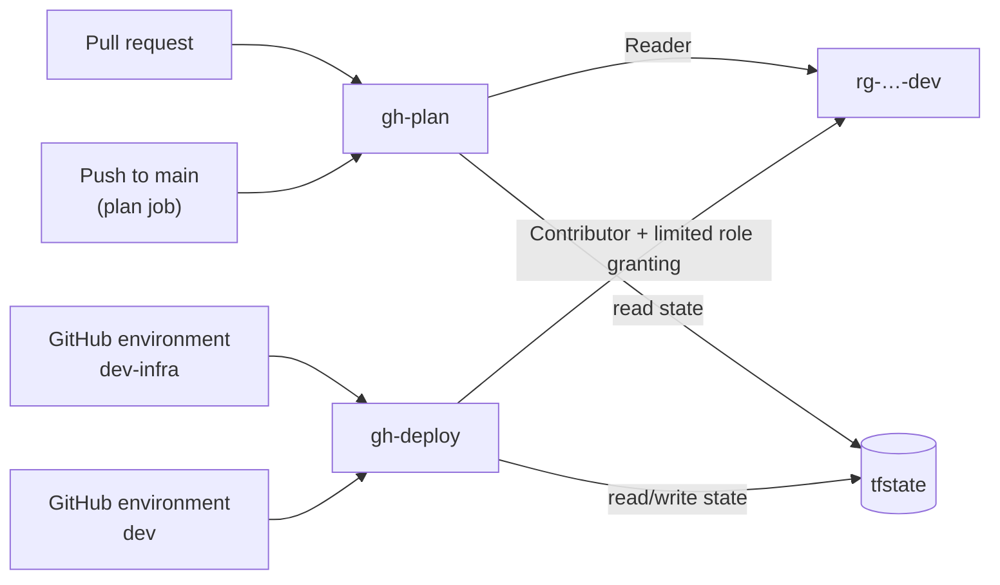

# Deployment

How the infrastructure is organised, and how to set it up in your own Azure subscription.

## How it's organised

All Azure infrastructure is Terraform, in three layers ([ADR 0001](adr/0001-terraform-for-infrastructure.md)):

```text
infra/
├─ modules/        building blocks: state-storage, github-oidc-identity
├─ stacks/         compositions: bootstrap
└─ deployments/    where a stack meets a real subscription: backend, providers, values from env
```

There are two kinds of deployment:

| | What it creates | Who runs it |
|---|---|---|
| **Bootstrap** | Terraform state storage, the GitHub pipeline identities, the environment's resource group | A person with Owner rights, once. Re-run only when the bootstrap itself changes |
| **Platform** *(coming next)* | Everything the application runs on | The GitHub Actions pipeline |

The bootstrap can't run through the pipeline, because it creates what the pipeline needs to run: the identity the pipeline signs in as, and the storage that holds its state. Creating them also needs Owner-level rights, which shouldn't sit with any CI identity. So a person runs it once with reviewed Terraform code, and from then on the pipeline works inside the boundaries it set up.

## Prerequisites

- An Azure subscription where you're **Owner** (needed for the bootstrap only)
- [Azure CLI](https://learn.microsoft.com/cli/azure/install-azure-cli), signed in with `az login`
- [Terraform](https://developer.hashicorp.com/terraform/install) 1.10 or later
- Bash. On Windows, Git Bash works.

## Configuration

Nothing environment-specific is committed. Copy `.env.example` to `.env` (ignored by git) and fill it in:

| Variable | Example | Purpose |
|---|---|---|
| `ARM_SUBSCRIPTION_ID` | | Subscription to deploy into |
| `ARM_TENANT_ID` | | Entra tenant |
| `TF_VAR_location` | `canadacentral` | Region for every resource |
| `TF_VAR_name_prefix` | `paymentops` | Prefix for resource names |
| `TF_VAR_environment` | `dev` | Environment to prepare |
| `TF_VAR_github_repository` | `owner/name` | The only repository whose workflows can sign in to Azure |
| `TF_VAR_github_owner_id`, `TF_VAR_github_repository_id` | | Numeric IDs, part of the OIDC subject (below). `gh api repos/OWNER/NAME --jq '.owner.id, .id'` |
| `TF_STATE_*` | | Written by the bootstrap script on its first run |

## Bootstrap

```bash
az account set --subscription <subscription-id>
scripts/bootstrap.sh
```

On the first run the script:

1. applies the bootstrap stack with local state;
2. records where the state storage is in `.env`;
3. moves its own state into that storage, then deletes the local copy.

Later runs apply against the remote state directly. To check for drift, run the script and review the plan before confirming.

### What it creates

| Resource | Notes |
|---|---|
| `rg-<prefix>-bootstrap` | Long-lived: state storage and pipeline identities |
| `rg-<prefix>-<environment>` | The environment's resource group, initially empty |
| State storage account | Zone-redundant. Entra ID only (account keys disabled), TLS 1.2, versioning, 30-day soft delete for blobs and containers, and a delete lock |
| `id-<prefix>-gh-plan` | Pipeline identity for read-only plans |
| `id-<prefix>-gh-deploy` | Pipeline identity for approved deployments |

The cost is a few cents a month.

## Pipeline identities

GitHub Actions signs in to Azure with OpenID Connect: each workflow run gets a short-lived token from GitHub, which Azure exchanges for access. No credentials are stored in GitHub. Each identity trusts only specific workflow contexts in this repository, and a fork's workflows are rejected because their tokens name a different repository.

The trust is matched on the token's subject claim. For repositories created after 15 July 2026, GitHub includes the immutable owner and repository IDs in it, for example `repo:owner@123/name@456:pull_request`, so a renamed or re-created repository can't inherit the trust. The bootstrap builds subjects in this form and, when the GitHub CLI is available, checks the prefix against the one GitHub reports (`gh api repos/OWNER/NAME/actions/oidc/customization/sub`).



| Identity | Trusted contexts | Permissions |
|---|---|---|
| `gh-plan` | Pull requests; the `main` branch | Reader on the environment's resource group; read-only access to state (plans run with `-lock=false`) |
| `gh-deploy` | GitHub environments `<env>-infra` and `<env>` only | Contributor on the environment's resource group; read/write state; limited role granting (below) |

A pull request can show what *would* change, but cannot change anything. Only jobs running in the named GitHub environments can use `gh-deploy`. Protection rules on those environments, including required reviewers, are set up together with the deployment workflows.

**Limited role granting.** The platform uses managed identities with key-based access disabled everywhere, so deploying it involves assigning roles. `gh-deploy` holds *Role Based Access Control Administrator* with a condition attached. It may assign only these allow-listed platform roles, and only to service principals such as managed identities:

- Cognitive Services OpenAI User
- Cognitive Services User
- Foundry User
- Search Index Data Reader
- Search Index Data Contributor
- Search Service Contributor
- Storage Blob Data Reader
- Storage Blob Data Contributor
- Log Analytics Reader

It cannot grant Owner or Contributor, and cannot assign roles to users or groups.

## Environments

One environment, `dev`, is deployed. The modules and stacks take the environment name as an input, so the design can grow into independently managed environments, but the bootstrap currently keeps a single state file for one environment. Running it with a different `TF_VAR_environment` would change the existing environment rather than add a second one.

## Removing the bootstrap

Bootstrap teardown isn't automated. The storage account holding the bootstrap's state is one of the resources the bootstrap manages, so destroying it in place would delete the state partway through. The teardown workflow will first migrate the state to a local backend, then remove the delete lock and destroy.
